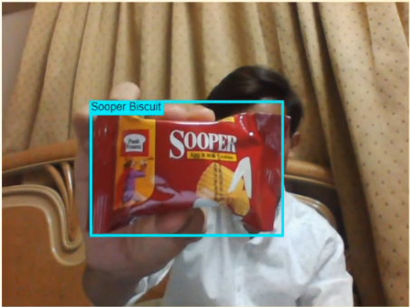

# 🎉 Realtime Grocery Items Detection 📸

### `Model is only trained on these Items`

<table>
  <tr>
<td></td> 
<td></td> 
<td></td> 
  </tr>
  <tr>
 <td>

</td>
    <td>

      </td>
 </tr>
</table>

## Setup
`git clone` the repo and `cd` into it by running the following command:

```bash
git clone https://github.com/saadpasta/Grocery-Items-Detection.git
cd Grocery-Items-Detection/
```

### `npm install`

> **Note: You’ll need to have Node 8.10.0 or later on your local development machine.** You can use [nvm](https://github.com/creationix/nvm#installation) (macOS/Linux) or [nvm-windows](https://github.com/coreybutler/nvm-windows#node-version-manager-nvm-for-windows) to easily switch Node versions between different projects.


## Run the App
### `npm start`

Open [http://localhost:3000](http://localhost:3000) to view it in the browser.

### Enjoy 😀 

### Video : https://bit.ly/32fR6Uk

